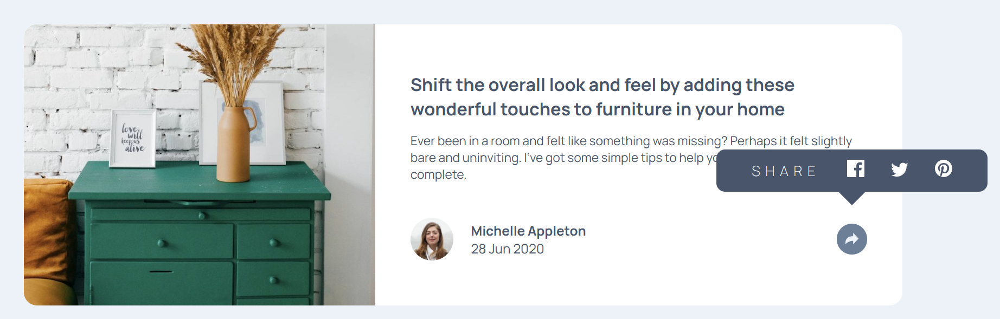
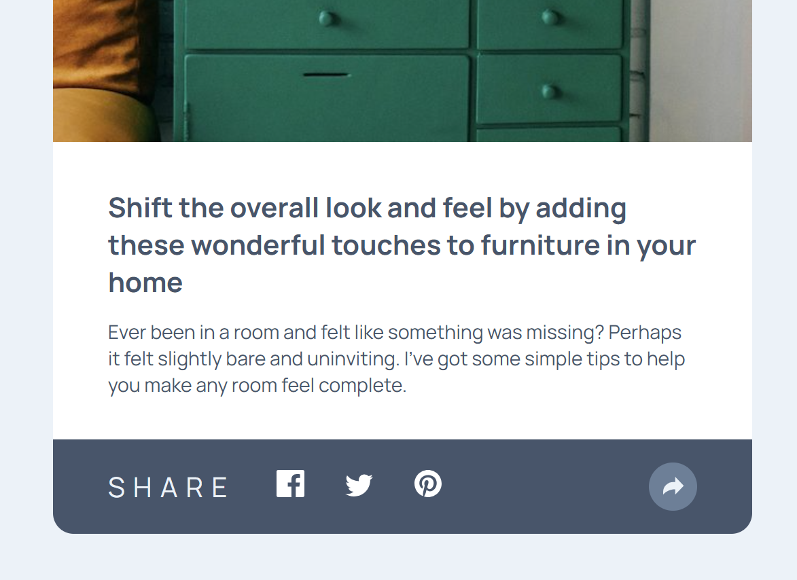

# Frontend Mentor - Article preview component solution

This is a solution to the [Article preview component challenge on Frontend Mentor](https://www.frontendmentor.io/challenges/article-preview-component-dYBN_pYFT). Frontend Mentor challenges help you improve your coding skills by building realistic projects. 

## Table of contents

- [Overview](#overview)
  - [The challenge](#the-challenge)
  - [Screenshot](#screenshot)
  - [Links](#links)
- [My process](#my-process)
  - [Built with](#built-with)
  - [What I learned](#what-i-learned)
- [Acknowledgments](#acknowledgments)

## Overview

### The challenge

Users should be able to:

- View the optimal layout for the component depending on their device's screen size
- See the social media share links when they click the share icon

### Screenshot




### Links

- Solution URL: [https://github.com/hrong1/Article-preview-component](https://github.com/hrong1/Article-preview-component)
- Live Site URL: [https://hrong1.github.io/Article-preview-component/](https://hrong1.github.io/Article-preview-component/)

## My process

### Built with

- Semantic HTML5 markup
- CSS custom properties
- Flexbox
- CSS Grid
- Mobile-first workflow

### What I learned

Learn how to use css to draw a triangle.

```css
.share-bar::after {
    content: '';
    position: absolute;
    top: 100%;
    left: 50%;
    transform: translateX(-50%);
    border-width: 0.8rem;
    border-style: solid;
    border-color: var(--Very-Dark-Grayish-Blue) transparent transparent transparent;
}
```

## Acknowledgments

Use Gemini 2.5 pro help on draw the pop up
